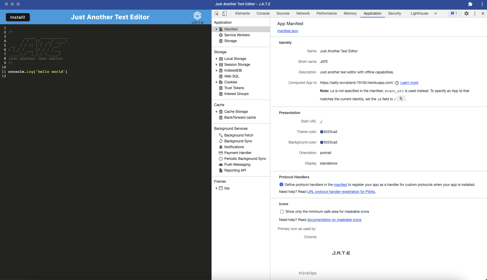

# Just Another Text Editor
https://salty-scrubland-79160.herokuapp.com/

## Description

This text editor runs in the browser. It's a single-page application that meets the PWA criteria and features a number of data persistence techniques that serve as redundancy in case one of the options is not supported by the browser. The application also functions offline.

## Usage

To install from the project repository, run the following commands from the root of the directory:
```
npm install
```

```
npm start
```

To use after installation or from the deployment link, click the Install button to download the web application as an icon on your desktop.

## Screenshots
The following image shows the application's manifest.json file:


The following image shows the application's registered service worker:


The following image shows the application's IndexedDB storage:
